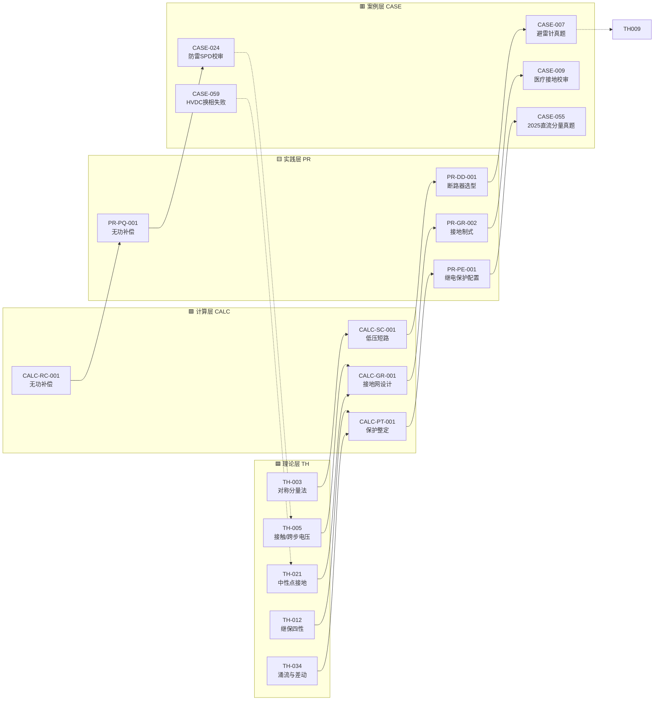

# 图谱 01：核心闭环

> 四层闭环基线：**理论 TH → 计算 CALC → 实践 PR → 案例 CASE**。本图展示最典型的 5 个理论条目如何驱动 4 个计算条目、4 个实践条目，最终落到 5 个真实案例。

!!! info "使用说明"
    - **实线** = 已建显式引用（条目正文含"关联条目"段）
    - **虚线** = 待补（条目引用了该上游但未显式标注）
    - 颜色分层：🟦 理论 ｜ 🟩 计算 ｜ 🟨 实践 ｜ 🟥 案例

## 闭环路径速查

| 路径 | 理论 → 计算 → 实践 → 案例 |
|---|---|
| 短路保护链 | TH-003 对称分量 → CALC-SC-001 低压短路 → PR-DD-001 断路器选型 → CASE-007 避雷针真题 |
| 接地安全链 | TH-005 跨步电压 → CALC-GR-001 接地网 → PR-GR-002 接地制式 → CASE-009 医疗接地 |
| 保护整定链 | TH-012 继保四性 → CALC-PT-001 保护整定 → PR-PE-001 保护配置 → CASE-055 真题 |
| 无功补偿链 | TH-034 涌流 → CALC-RC-001 无功补偿 → PR-PQ-001 无功补偿 → CASE-024 SPD 校审 |

---

[← 返回图谱索引](引用图谱.md)
