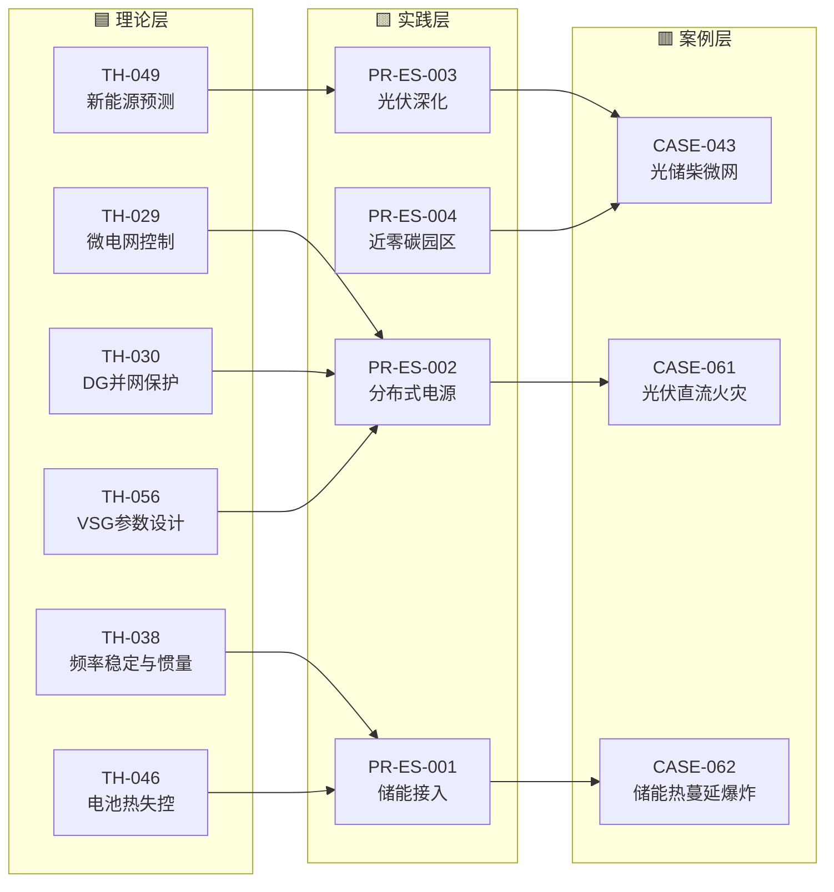

# 图谱 02：新能源 + 储能主题闭环

> 新能源接入、储能安全、微电网控制是当前电气工程最活跃的方向。这条链从 6 个核心理论出发，经过 4 个实践条目（储能接入/分布式电源/光伏深化/近零碳园区），落到 3 个真实事故案例。

## 关键路径

| 路径 | 说明 |
|---|---|
| TH-046 电池热失控 → PR-ES-001 储能接入 → CASE-062 储能爆炸 | 储能安全核心链：从单体热失控机理到 PACK 级蔓延事故 |
| TH-030 DG 并网保护 → PR-ES-002 分布式电源 → CASE-061 光伏火灾 | 分布式接入保护链：从孤岛检测到直流拉弧火灾 |
| TH-049 新能源预测 → PR-ES-003 光伏深化 → CASE-043 光储柴微网 | 预测+配置链：从出力不确定性到微电网完整方案 |
| TH-056 VSG → PR-ES-002 → CASE-062 | VSG 参数设计不当导致惯量支撑丧失 |

---

[← 返回图谱索引](引用图谱.md)
