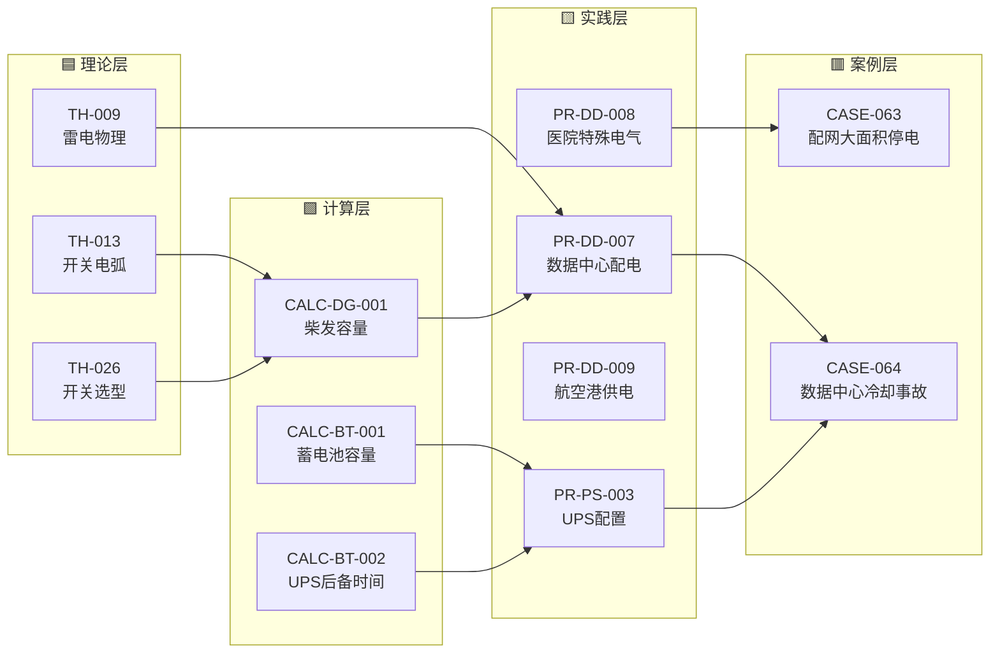

# 图谱 03：数据中心 + 工业配电主题闭环

> 数据中心、医院、航空港属于"关键负荷"建筑——供电可靠性要求最高。这条链从雷电/电弧/开关选型三个理论出发，经过柴发容量/蓄电池/UPS 后备三个计算，落到 4 个行业实践和 2 个真实事故。

## 关键路径

| 路径 | 说明 |
|---|---|
| TH-013 电弧 → CALC-DG-001 柴发容量 → PR-DD-007 数据中心 → CASE-064 冷却事故 | 柴发选型链：从电弧开断到柴发容量再到 ATS 切换事故 |
| CALC-BT-002 UPS 后备 → PR-PS-003 UPS 配置 → CASE-064 | UPS 链：后备时间计算不足导致空调失电 |
| TH-009 雷电 → PR-DD-007 数据中心 → CASE-064 | 雷电防护链：数据中心防雷 + SPD 配合 |

---

[← 返回图谱索引](引用图谱.md)
