# 图谱 04：变配电一次设备选型链（典型 35 kV / 10 kV）

> 这是"理论→计算→选型→案例"最标准的一条链。从变压器漏抗出发，经过短路热稳定、动稳定、绝缘配合三个计算，最终落到断路器/电缆/避雷器/电流互感器的选型，每个选型都有真实案例佐证。

```mermaid
graph TD
    subgraph "🟦 理论层（选型依据）"
        TH006[TH-006<br/>变压器漏抗与短路阻抗]
        TH009[TH-009<br/>雷电物理与绝缘配合]
        TH013[TH-013<br/>开关电弧与开断机理]
        TH017[TH-017<br/>VFTO与特快速暂态]
        TH022[TH-022<br/>过电压绝缘配合]
        TH025[TH-025<br/>电缆热场与载流量]
        TH026[TH-026<br/>开关电器选型原则]
        TH039[TH-039<br/>发电机断路器特殊要求]
    end
    
    subgraph "🟩 计算层（选型计算）"
        SC1[CALC-SC-001<br/>低压三相短路]
        SC2[CALC-SC-002<br/>高压系统短路]
        SC3[CALC-SC-003<br/>直流分量衰减]
        SC4[CALC-SC-004<br/>IEC 60909暂态电动势]
        LT1[CALC-LT-001<br/>电缆载流量]
        LT2[CALC-LT-002<br/>电缆电压降]
        RC1[CALC-RC-001<br/>无功补偿容量]
        VL1[CALC-VL-001<br/>绝缘配合计算]
    end
    
    subgraph "🟨 实践层（设备选型）"
        PRDD1[PR-DD-001<br/>断路器选型]
        PRDD2[PR-DD-002<br/>GIS选型与VFTO]
        PRDD3[PR-DD-003<br/>电流/电压互感器选型]
        PRDD4[PR-DD-004<br/>避雷器与绝缘配合]
        PRDD5[PR-DD-005<br/>电缆选型]
        PRDD7[PR-DD-007<br/>数据中心配电]
        PRDD8[PR-DD-008<br/>医院特殊电气]
        PRDD9[PR-DD-009<br/>航空港供电]
    end
    
    subgraph "🟥 案例层（选型事故/真题）"
        CASE007[CASE-007<br/>避雷针选型真题]
        CASE024[CASE-024<br/>防雷SPD校审]
        CASE030[CASE-030<br/>断路器开断失败]
        CASE037[CASE-037<br/>PT铁磁谐振烧损]
        CASE055[CASE-055<br/>2025直流分量校验]
        CASE056[CASE-056<br/>2018弧光过电压]
        CASE061[CASE-061<br/>光伏直流火灾]
    end

    %% 理论 → 计算
    TH006 --> SC1 & SC2
    TH009 --> VL1
    TH013 --> SC3 & PRDD1
    TH017 --> PRDD2
    TH022 --> VL1 & PRDD4
    TH025 --> LT1 & LT2
    TH026 --> PRDD1 & PRDD2
    TH039 --> SC4

    %% 计算 → 选型
    SC1 --> PRDD1 & PRDD5
    SC2 --> PRDD1 & PRDD2
    SC3 --> PRDD1
    SC4 --> PRDD1 & PRDD7
    LT1 --> PRDD5
    LT2 --> PRDD5 & PRDD7
    RC1 --> PRDD7 & PRDD8
    VL1 --> PRDD4 & PRDD8

    %% 选型 → 案例
    PRDD1 --> CASE030 & CASE055
    PRDD2 --> CASE037
    PRDD3 --> CASE037
    PRDD4 --> CASE007 & CASE024 & CASE056
    PRDD5 --> CASE061
    PRDD7 --> CASE061

    style TH006 fill:#4FC3F7,stroke:#0277BD,color:#fff
    style TH009 fill:#4FC3F7,stroke:#0277BD,color:#fff
    style TH013 fill:#4FC3F7,stroke:#0277BD,color:#fff
    style TH017 fill:#4FC3F7,stroke:#0277BD,color:#fff
    style TH022 fill:#4FC3F7,stroke:#0277BD,color:#fff
    style TH025 fill:#4FC3F7,stroke:#0277BD,color:#fff
    style TH026 fill:#4FC3F7,stroke:#0277BD,color:#fff
    style TH039 fill:#4FC3F7,stroke:#0277BD,color:#fff
    style SC1 fill:#81C784,stroke:#2E7D32,color:#fff
    style SC2 fill:#81C784,stroke:#2E7D32,color:#fff
    style SC3 fill:#81C784,stroke:#2E7D32,color:#fff
    style SC4 fill:#81C784,stroke:#2E7D32,color:#fff
    style LT1 fill:#81C784,stroke:#2E7D32,color:#fff
    style LT2 fill:#81C784,stroke:#2E7D32,color:#fff
    style RC1 fill:#81C784,stroke:#2E7D32,color:#fff
    style VL1 fill:#81C784,stroke:#2E7D32,color:#fff
    style PRDD1 fill:#FFB74D,stroke:#E65100,color:#fff
    style PRDD2 fill:#FFB74D,stroke:#E65100,color:#fff
    style PRDD3 fill:#FFB74D,stroke:#E65100,color:#fff
    style PRDD4 fill:#FFB74D,stroke:#E65100,color:#fff
    style PRDD5 fill:#FFB74D,stroke:#E65100,color:#fff
    style PRDD7 fill:#FFB74D,stroke:#E65100,color:#fff
    style PRDD8 fill:#FFB74D,stroke:#E65100,color:#fff
    style PRDD9 fill:#FFB74D,stroke:#E65100,color:#fff
    style CASE007 fill:#E57373,stroke:#B71C1C,color:#fff
    style CASE024 fill:#E57373,stroke:#B71C1C,color:#fff
    style CASE030 fill:#E57373,stroke:#B71C1C,color:#fff
    style CASE037 fill:#E57373,stroke:#B71C1C,color:#fff
    style CASE055 fill:#E57373,stroke:#B71C1C,color:#fff
    style CASE056 fill:#E57373,stroke:#B71C1C,color:#fff
    style CASE061 fill:#E57373,stroke:#B71C1C,color:#fff
```

## 选型链解读

| 设备 | 关键理论 | 关键计算 | 代表案例 |
|---|---|---|---|
| **断路器** | TH-026 开关选型 / TH-013 电弧 / TH-039 GCB | CALC-SC-001~004 全套短路 | CASE-055（真题）、CASE-030（开断失败） |
| **GIS** | TH-017 VFTO | CALC-SC-002 | CASE-037（PT 铁磁谐振） |
| **CT/PT** | TH-012 继保四性 | CALC-PT-001 整定 | CASE-037（PT 烧损） |
| **避雷器** | TH-009 雷电 / TH-022 绝缘配合 | CALC-VL-001 | CASE-007（避雷针真题）、CASE-024（SPD 校审） |
| **电缆** | TH-025 热场 | CALC-LT-001/002 | CASE-061（光伏火灾电缆） |
| **变压器** | TH-006 漏抗 | CALC-SC-001/002 | CASE-037（PT 谐振） |
| **行业配电网** | 上面全部 | 上面全部 | CASE-061（光伏）、CASE-056（弧光过压）、CASE-007（医院） |

---

[← 返回图谱索引](引用图谱.md)
