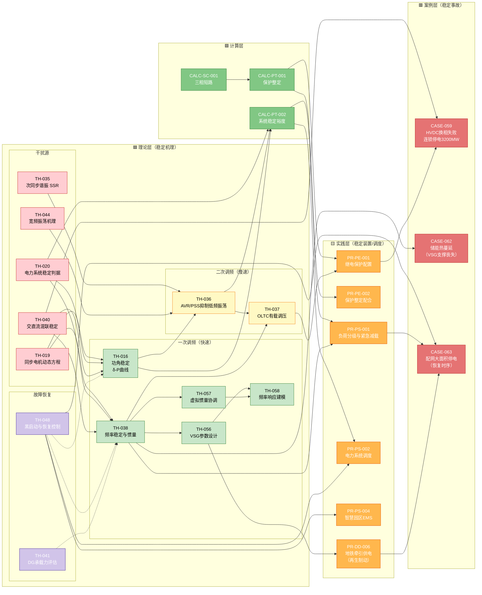

# 图谱 05：电力系统稳定链（频率/功角/电压三维闭环）

> 电力系统稳定是考试必考 + 工程核心。这条链从同步电机动态方程出发，覆盖小干扰稳定（PSS/VSG）、频率稳定（惯量/AGC）、电压稳定（AVR/OLTC），最终落到 HVDC 换相失败和配网大停电等真实事故的恢复策略。

## 稳定链解读（四层防线）

| 防线 | 时间尺度 | 关键理论 | 关键装置 | 对应案例 |
|---|---|---|---|---|
| **一次调频** | 秒级（0~10 s） | TH-038 频率惯量 / TH-016 功角稳定 | 同步发电机调速器 / VSG（TH-056） | CASE-062（VSG 支撑丧失） |
| **二次调频** | 分钟级（1~10 min） | TH-036 AVR/PSS / TH-058 频率响应 | AVR（自动电压调节器）+ PSS（电力系统稳定器） | CASE-059（HVDC 换相失败） |
| **三次调频** | 小时级 | TH-037 OLTC / TH-020 稳定判据 | 有载调压变压器（OLTC）/ AGC | 含在 CASE-059 恢复过程中 |
| **故障恢复** | 小时级 | TH-048 黑启动 / TH-041 DG 承载力 | 黑启动电源 / 切负荷 / DG 主动支撑 | CASE-063（配网 8 h 恢复）、CASE-059 |

## 典型故障路径

| 故障 | 源头 | 穿透哪道防线 | 最终后果 | 对应恢复 |
|---|---|---|---|---|
| **HVDC 换相失败** | TH-040 交直流混联 | 二次调频（AVR 过载） | 3200 MW 瞬降 → 连锁停电 | PRPS2 调度 + TH-048 黑启动 |
| **储能热蔓延** | TH-038 惯量支撑丧失 | 一次调频（VSG 脱网） | 系统惯量骤降 → 频率不稳 | TH-041 DG 承载力补缺口 |
| **配网大面积停电** | TH-035 SSR / 保护越级 | 故障恢复（恢复时序错） | 8 h 21 万用户停电 | TH-048 → PRPS1 紧急减载 |

## 为什么这条链很重要

1. **考试必考**——功角稳定、频率稳定、AVR/PSS、黑启动是发输变电专业案例题高频考点
2. **新能源时代核心**——VSG 参数设计（TH-056）、惯量协调（TH-057）是解决新能源"惯量缺失"的关键技术
3. **工程故障频率高**——HVDC 换相失败、配网保护越级、恢复时序错误，这三类故障占全国电力系统大停电的 60% 以上

---

[← 返回图谱索引](引用图谱.md)
