# 图谱 06：医院 IT 系统链（医疗场所电气安全闭环）

> 医院是电气安全要求最高的民用建筑——手术室 0.5 ms 断电、IT 系统不跳闸只报警、等电位联结 ≤ 0.1 Ω。这条链从人体电流生理效应出发，经过接触电压/接地故障精算，落到医用 IT 系统设计 + SPD 配合，最终用真实校审事故闭环。

```mermaid
graph TD
    subgraph "🟦 理论层（安全机理）"
        TH001[TH-001<br/>电磁场基本方程]
        TH004[TH-004<br/>人体电流与安全电压]
        TH005[TH-005<br/>接触/跨步电压]
        TH007[TH-007<br/>波过程与行波]
        TH012[TH-012<br/>继保四性]
        TH021[TH-021<br/>中性点接地方式]
        TH031[TH-031<br/>接地变与消弧线圈]
        TH034[TH-034<br/>涌流与差动保护]
    end

    subgraph "🟩 计算层（安全计算）"
        CALCGR1[CALC-GR-001<br/>接地网设计]
        CALCGR2[CALC-GR-002<br/>接地故障电流精算]
        CALCSC1[CALC-SC-001<br/>低压三相短路]
        CALCFT1[CALC-FT-001<br/>弧光接地过电压]
        CALCLD1[CALC-LD-001<br/>负荷计算]
    end

    subgraph "🟨 实践层（医疗电气设计）"
        PRDD7[PR-DD-007<br/>数据中心配电]
        PRDD8[PR-DD-008<br/>医院特殊电气设计]
        PRGR1[PR-GR-001<br/>防雷设计]
        PRGR2[PR-GR-002<br/>接地制式选择]
        PRGR3[PR-GR-003<br/>SPD选型与配合]
        PRCM1[PR-CM-001<br/>消防联动]
        PRPS1[PR-PS-001<br/>负荷分级]
        PRPS3[PR-PS-003<br/>UPS与蓄电池]
    end

    subgraph "🟥 案例层（医疗/建筑事故）"
        CASE009[CASE-009<br/>医疗接地校审]
        CASE024[CASE-024<br/>防雷SPD校审]
        CASE037[CASE-037<br/>PT铁磁谐振烧损]
        CASE063[CASE-063<br/>配网大面积停电]
        CASE064[CASE-064<br/>数据中心冷却事故]
    end

    %% 理论 → 计算
    TH004 --> CALCGR2
    TH005 --> CALCGR1
    TH021 --> CALCGR2
    TH031 --> CALCFT1
    TH034 --> CALCSC1
    TH001 --> CALCGR1
    TH007 --> PRGR1

    %% 计算 → 实践
    CALCGR1 --> PRGR2
    CALCGR2 --> PRDD8
    CALCSC1 --> PRDD8
    CALCFT1 --> PRGR3
    CALCLD1 --> PRDD8
    CALCGR1 --> PRGR2

    %% 理论 → 实践（跨层）
    TH004 --> PRDD8
    TH021 --> PRGR2
    TH012 --> PRPS1
    TH034 --> PRPS3

    %% 实践内部
    PRGR2 --> PRDD8
    PRGR1 --> PRGR3
    PRGR3 --> PRDD8
    PRPS1 --> PRDD8
    PRPS3 --> PRDD8
    PRCM1 --> PRDD8

    %% 实践 → 案例
    PRDD8 --> CASE009
    PRGR2 --> CASE009
    PRGR3 --> CASE024
    PRGR1 --> CASE024
    PRPS3 --> CASE064
    PRDD7 --> CASE064
    PRPS1 --> CASE063
    PRCM1 --> CASE063

    %% 理论 → 案例（直接因果）
    TH021 -.-> CASE063

    %% 样式：理论层
    style TH001 fill:#4FC3F7,stroke:#0277BD,color:#fff
    style TH004 fill:#4FC3F7,stroke:#0277BD,color:#fff
    style TH005 fill:#4FC3F7,stroke:#0277BD,color:#fff
    style TH007 fill:#4FC3F7,stroke:#0277BD,color:#fff
    style TH012 fill:#4FC3F7,stroke:#0277BD,color:#fff
    style TH021 fill:#4FC3F7,stroke:#0277BD,color:#fff
    style TH031 fill:#4FC3F7,stroke:#0277BD,color:#fff
    style TH034 fill:#4FC3F7,stroke:#0277BD,color:#fff
    %% 样式：计算层
    style CALCGR1 fill:#81C784,stroke:#2E7D32,color:#fff
    style CALCGR2 fill:#81C784,stroke:#2E7D32,color:#fff
    style CALCSC1 fill:#81C784,stroke:#2E7D32,color:#fff
    style CALCFT1 fill:#81C784,stroke:#2E7D32,color:#fff
    style CALCLD1 fill:#81C784,stroke:#2E7D32,color:#fff
    %% 样式：实践层
    style PRDD7 fill:#FFB74D,stroke:#E65100,color:#fff
    style PRDD8 fill:#FFB74D,stroke:#E65100,color:#fff
    style PRGR1 fill:#FFB74D,stroke:#E65100,color:#fff
    style PRGR2 fill:#FFB74D,stroke:#E65100,color:#fff
    style PRGR3 fill:#FFB74D,stroke:#E65100,color:#fff
    style PRCM1 fill:#FFB74D,stroke:#E65100,color:#fff
    style PRPS1 fill:#FFB74D,stroke:#E65100,color:#fff
    style PRPS3 fill:#FFB74D,stroke:#E65100,color:#fff
    %% 样式：案例层
    style CASE009 fill:#E57373,stroke:#B71C1C,color:#fff
    style CASE024 fill:#E57373,stroke:#B71C1C,color:#fff
    style CASE037 fill:#E57373,stroke:#B71C1C,color:#fff
    style CASE063 fill:#E57373,stroke:#B71C1C,color:#fff
    style CASE064 fill:#E57373,stroke:#B71C1C,color:#fff
```

## 医院电气安全链解读

| 安全环节 | 关键理论 | 关键计算 | 设计实践 | 验证案例 |
|---|---|---|---|---|
| **人体安全** | TH-004 人体电流（摆脱/室颤阈值） | CALC-GR-002 接地故障电流（IT 系统仅 1.8 mA） | PR-DD-008 医用 IT 系统（绝缘监测 + 报警不跳闸） | CASE-009（医疗接地校审） |
| **接触电压** | TH-005 接触/跨步电压 | CALC-GR-001 接地网设计（≤ 50 V） | PR-GR-002 接地制式（IT vs TT vs TN） | CASE-009 |
| **中性点接地** | TH-021 中性点接地方式 | CALC-FT-001 弧光过电压 | PR-GR-002 IT 系统选择 | CASE-063（配网停电） |
| **SPD 配合** | TH-007 波过程（行波入侵） | CALC-FT-001 弧光过电压 | PR-GR-003 SPD 选型 + PR-GR-001 防雷 | CASE-024（SPD 校审） |
| **UPS 后备** | TH-034 涌流（变压器投切） | CALC-LD-001 负荷计算 | PR-PS-003 UPS 配置 | CASE-064（数据中心冷却） |
| **负荷分级** | TH-012 继保四性 | CALC-SC-001 短路电流 | PR-PS-001 负荷分级（一级/保安） | CASE-063 |

## 医用 IT 系统核心设计要点

| 要点 | 标准 | 参数 |
|---|---|---|
| 手术室供电 | GB 51348-2019 第 9.2.6 条 | 医用 IT 系统，不切断电源 |
| 绝缘监测 | IEC 61557-8 | 绝缘电阻 < 50 kΩ 报警，不跳闸 |
| 等电位联结 | GB 16895.24 | 端子板 → 参考点 ≤ 0.1 Ω |
| 断电时间 | GB 51348 表 9.2 | 0 类场所 ≤ 0.5 s |
| SPD 配合 | PR-GR-003 | 进线 SPD（T1） + 医疗设备前端 SPD（T2） |

## 典型校审问题路径

| 问题 | 根因 | 对应条目 |
|---|---|---|
| **手术室误跳闸** | 用 TN-S 而非 IT 系统（单相接地即跳闸） | TH-021 → PR-GR-002 → CASE-009 |
| **SPD 级间未配合** | T1/T2 间距 < 10 m，行波叠加 | TH-007 → CALC-FT-001 → PR-GR-003 → CASE-024 |
| **UPS 切换时序错** | 精密空调未接在 ATS 后端 | TH-034 → PR-PS-003 → CASE-064 |
| **配网保护越级** | 时限配合反向 | TH-012 → CALC-SC-001 → PR-PS-001 → CASE-063 |

---

[← 返回图谱索引](引用图谱.md)
