# 图谱 07：AI 与数字孪生链（人工智能 × 电气工程前沿闭环）

> AI 在电气工程的应用从"辅助工具"走向"自主决策"。这条链以 TH-043 AI 基础为根，分三条枝：① VSG 参数自适应整定（TH-061，强化学习）；② 储能级联故障数字孪生（TH-062，LSTM+GNN+PINN）；③ 设备状态预测与诊断（TH-047/050，监督学习）。三者共用"物理信息神经网络（PINN）"约束，形成"数据-模型-物理"三层耦合闭环。

```mermaid
graph TD
    subgraph "🟦 理论层（AI 基础与前沿）"
        TH043[TH-043<br/>AI 基础<br/>ML/DL/PINN/孪生]
        TH061[TH-061<br/>VSG 参数 AI 整定<br/>PPO+PINN]
        TH062[TH-062<br/>储能级联故障孪生<br/>LSTM+GNN]
        TH046[TH-046<br/>电池热失控机理]
        TH055[TH-055<br/>级联故障与热蔓延]
        TH056[TH-056<br/>VSG 参数设计<br/>固定参数基线]
        TH047[TH-047<br/>XLPE 电缆水树老化]
        TH050[TH-050<br/>变压器套管故障诊断]
        TH049[TH-049<br/>新能源预测与不确定性]
    end

    subgraph "🟩 计算层（AI 驱动计算）"
        CALCSC5[CALC-SC-005<br/>直流短路计算<br/>PCS 直流侧]
        CALCSC6[CALC-SC-006<br/>有源配电网短路<br/>PCS 短路贡献]
        CALCBT1[CALC-BT-001<br/>蓄电池容量]
    end

    subgraph "🟨 实践层（AI 赋能工程）"
        PRES1[PR-ES-001<br/>储能接入]
        PRES4[PR-ES-004<br/>近零碳园区]
        PRPS4[PR-PS-004<br/>智慧园区能管 EMS]
        PRDD4[PR-DD-004<br/>配网自动化与 SCADA]
        PRDD5[PR-DD-005<br/>变电所综合自动化]
    end

    subgraph "🟥 案例层（AI 预防/诊断事故）"
        CASE052[CASE-052<br/>蓄电池组火灾]
        CASE062[CASE-062<br/>电池热蔓延事故]
        CASE063[CASE-063<br/>配网大面积停电]
        CASE064[CASE-064<br/>数据中心冷却事故]
        CASE040[CASE-040<br/>短路直流分量事故]
    end

    %% 理论 → 理论（AI 三枝）
    TH043 --> TH061
    TH043 --> TH062
    TH043 --> TH047
    TH043 --> TH050
    TH043 --> TH049
    TH056 --> TH061
    TH046 --> TH062
    TH055 --> TH062

    %% 理论 → 计算
    TH062 --> CALCSC5
    TH061 --> CALCSC6
    TH046 --> CALCBT1

    %% 计算 → 实践
    CALCSC5 --> PRES1
    CALCSC6 --> PRDD4
    CALCBT1 --> PRES1

    %% 理论 → 实践（跨层）
    TH061 --> PRES1
    TH062 --> PRES1
    TH049 --> PRES4
    TH043 --> PRPS4
    TH043 --> PRDD5

    %% 实践内部
    PRES1 --> PRES4
    PRPS4 --> PRES4
    PRDD4 --> PRDD5

    %% 实践 → 案例
    PRES1 --> CASE052
    PRES1 --> CASE062
    PRDD4 --> CASE063
    PRPS4 --> CASE064
    CALCSC5 --> CASE052

    %% 理论 → 案例（直接因果）
    TH055 -.-> CASE062
    TH046 -.-> CASE052
    TH061 -.-> CASE040

    %% 样式：理论层
    style TH043 fill:#4FC3F7,stroke:#0277BD,color:#fff
    style TH061 fill:#4FC3F7,stroke:#0277BD,color:#fff
    style TH062 fill:#4FC3F7,stroke:#0277BD,color:#fff
    style TH046 fill:#4FC3F7,stroke:#0277BD,color:#fff
    style TH055 fill:#4FC3F7,stroke:#0277BD,color:#fff
    style TH056 fill:#4FC3F7,stroke:#0277BD,color:#fff
    style TH047 fill:#4FC3F7,stroke:#0277BD,color:#fff
    style TH050 fill:#4FC3F7,stroke:#0277BD,color:#fff
    style TH049 fill:#4FC3F7,stroke:#0277BD,color:#fff
    %% 样式：计算层
    style CALCSC5 fill:#81C784,stroke:#2E7D32,color:#fff
    style CALCSC6 fill:#81C784,stroke:#2E7D32,color:#fff
    style CALCBT1 fill:#81C784,stroke:#2E7D32,color:#fff
    %% 样式：实践层
    style PRES1 fill:#FFB74D,stroke:#E65100,color:#fff
    style PRES4 fill:#FFB74D,stroke:#E65100,color:#fff
    style PRPS4 fill:#FFB74D,stroke:#E65100,color:#fff
    style PRDD4 fill:#FFB74D,stroke:#E65100,color:#fff
    style PRDD5 fill:#FFB74D,stroke:#E65100,color:#fff
    %% 样式：案例层
    style CASE052 fill:#E57373,stroke:#B71C1C,color:#fff
    style CASE062 fill:#E57373,stroke:#B71C1C,color:#fff
    style CASE063 fill:#E57373,stroke:#B71C1C,color:#fff
    style CASE064 fill:#E57373,stroke:#B71C1C,color:#fff
    style CASE040 fill:#E57373,stroke:#B71C1C,color:#fff
```

## AI 闭环解读

| AI 应用枝 | 根理论 | 核心算法 | 工程场景 | 验证案例 |
|---|---|---|---|---|
| **VSG 参数自适应** | TH-043 AI 基础 + TH-056 VSG 设计 | TH-061：PPO 强化学习 + PINN 物理约束 | PR-ES-001 储能接入（构网型 PCS） | CASE-040（短路直流分量，VSG 响应） |
| **级联故障孪生** | TH-043 AI 基础 + TH-046 热失控 + TH-055 级联机理 | TH-062：LSTM 时序 + GNN 传播 + PINN 热平衡 | PR-ES-001 储能舱消防协同 | CASE-052（蓄电池火灾）/ CASE-062（热蔓延） |
| **设备状态诊断** | TH-043 AI 基础 | 监督学习（CNN/SVM） | TH-047 电缆老化 / TH-050 套管诊断 | - |

## 关键技术节点

| 节点 | 标准 | 关键参数 |
|---|---|---|
| TH-043 AI 基础 | GB/T 42018, DL/T 2547, IEC 62332 | PINN 损失 $L = L_{data} + \lambda L_{phys}$ |
| TH-061 VSG AI 整定 | GB/T 19963.1, GB/T 40595 | $J_v \in [1,10]$, $D_v \in [5,50]$，PPO clip $\epsilon=0.2$ |
| TH-062 储能孪生 | GB/T 44240, NFPA 855 | $mc_p dT/dt = I^2R + Q_{side}(T) - hA(T-T_{amb})$ |
| CALC-SC-005 直流短路 | IEC 61660, GB/T 22589 | $I_{k,B} = U_{B0}/(R_B+R_L)$，$\kappa_B$ 查表 |
| CALC-SC-006 有源配网短路 | IEC 60909, IEEE 1547 | PCS 峰值系数 $\kappa_{PCS}=1.0$ |

## AI 应用边界与红线

| 红线 | 说明 | 标准依据 |
|---|---|---|
| **参数限幅** | RL 输出必须限幅，$J_v \cdot D_v >$ 稳定性下限 | GB/T 19963.1 §5 |
| **安全监督层** | 在线 RL 异常时切回固定参数 | GB/T 41307 §4 |
| **可解释性** | RL 黑箱须保留决策日志 | DL/T 2547 §4 |
| **训练-实测 gap** | GNN 级联预测依赖仿真数据，需定期与实测对比（偏差 > 15% 重训） | DL/T 2547 §5 |
| **消防响应时间** | 数字孪生预测 → 消防介入 ≤ 5 min | NFPA 855 §4.6 |

---

[← 返回图谱索引](引用图谱.md)
