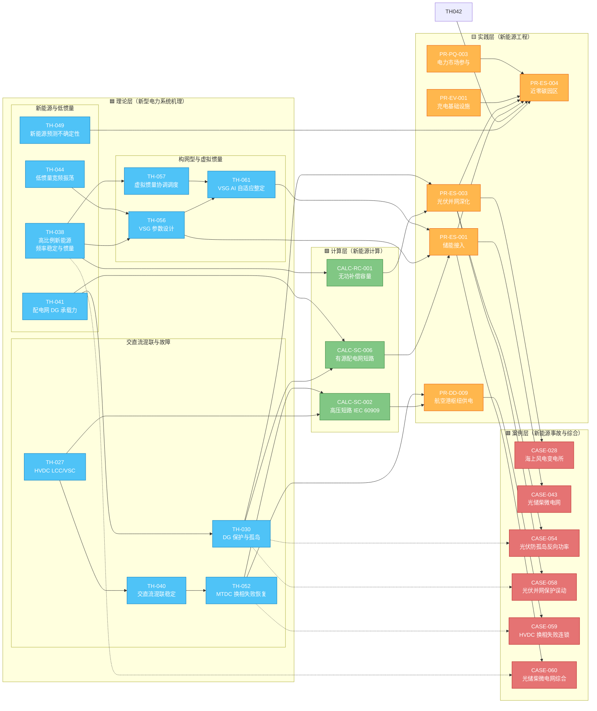

# 图谱 08：新型电力系统前沿链（高比例新能源 × 构网型 × 碳中和）

> 新型电力系统的核心矛盾是"双高"（高比例新能源 + 高比例电力电子），导致系统低惯量化、频率稳定脆弱。这条链从 TH-038 频率稳定与惯量出发，覆盖 VSG 构网型（TH-056/061）、MTDC 故障穿越（TH-052）、交直流混联稳定（TH-040），落到近零碳园区设计（PR-ES-004）和光储柴微电网事故（CASE-060）。

## 新型电力系统三维解读

| 维度 | 关键理论 | 关键计算 | 设计实践 | 验证案例 |
|---|---|---|---|---|
| **低惯量频率稳定** | TH-038 频率稳定与惯量 | CALC-RC-001 无功补偿（调频） | PR-ES-001 储能接入（构网型） | CASE-060 光储柴微电网 |
| **构网型控制** | TH-056 VSG 设计 + TH-061 AI 整定 | - | PR-ES-001 储能 PCS | CASE-040 短路直流分量 |
| **DG 接入与孤岛** | TH-030 DG 保护 + TH-041 承载力 | CALC-SC-006 有源配网短路 | PR-ES-003 光伏并网 | CASE-054 防孤岛 / CASE-058 保护误动 |
| **HVDC 与混联** | TH-027 HVDC + TH-040 混联 + TH-052 MTDC | CALC-SC-002 高压短路 | PR-DD-009 枢纽供电 | CASE-028 海上风电 / CASE-059 换相失败 |
| **碳中和园区** | TH-042 碳交易映射 + TH-049 预测 | - | PR-ES-004 近零碳园区 | CASE-043/060 微电网综合 |

## 新型电力系统核心标准

| 标准号 | 条款 | 关键要求 |
|---|---|---|
| GB/T 19963.1-2021 | §5 | 构网型电源虚拟惯量与阻尼边界 |
| GB/T 40595-2021 | 全文 | 一次调频试验（含虚拟惯量测试） |
| GB/T 19964-2024 | §4 | 光伏 LVRT 与无功电流注入 |
| GB/T 42288-2022 | §5,§7 | 储能安全与消防（数字孪生要求） |
| GB/T 40567-2021 | §5 | 分布式能源承载力评估 |
| GB/T 44240-2024 | §7 | 储能热失控防护（孪生模型强制） |
| NFPA 855-2023 | §4.6 | 储能簇级火灾 5 min 响应 |

## 前沿技术演进路径

| 代际 | 时间 | 核心技术 | 代表条目 |
|---|---|---|---|
| **第一代**（跟网型） | 2010~2020 | PLL 锁相，被动跟随电网 | TH-024 电力电子变换器 |
| **第二代**（VSG 固定参数） | 2020~2025 | 虚拟惯量 + 阻尼，模拟同步机 | TH-056 VSG 设计 |
| **第三代**（VSG AI 自适应） | 2025~ | 强化学习在线整定 | TH-061 VSG AI |
| **第四代**（数字孪生闭环） | 2026~ | 孪生平台 + 在线学习 + 消防协同 | TH-062 储能孪生 |

---

[← 返回图谱索引](引用图谱.md)
