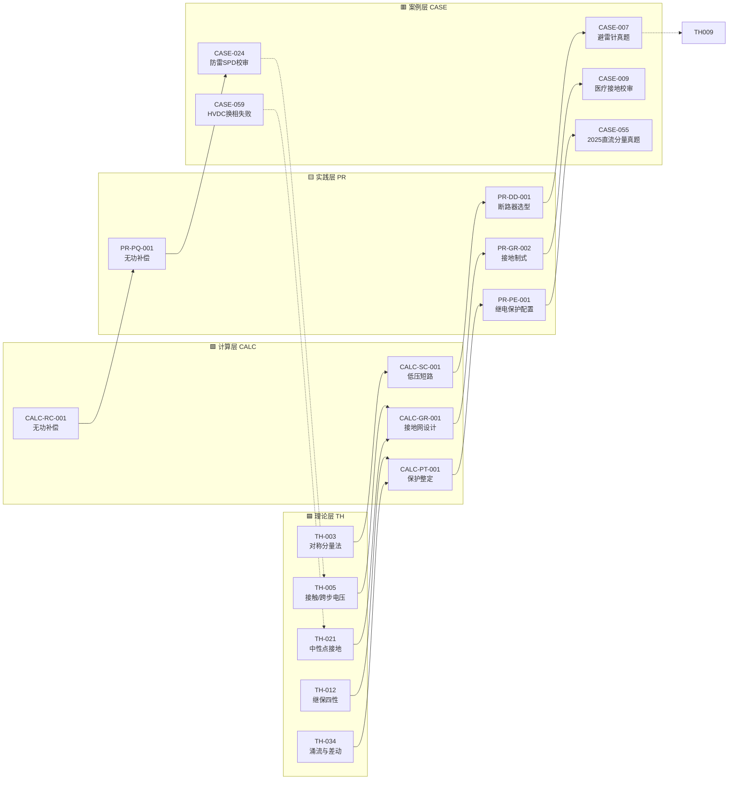
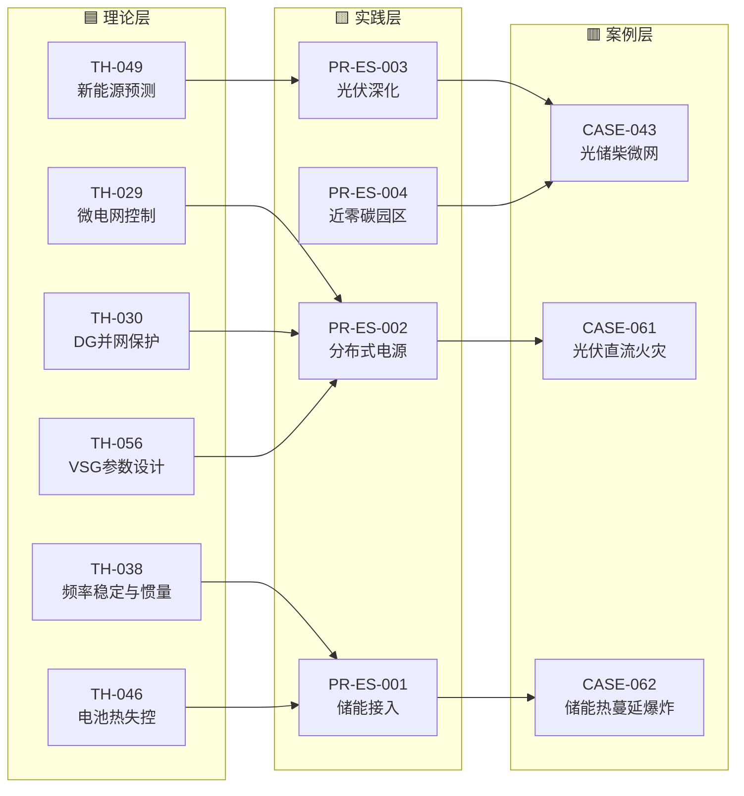
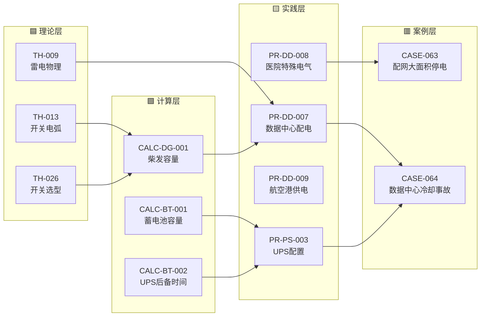
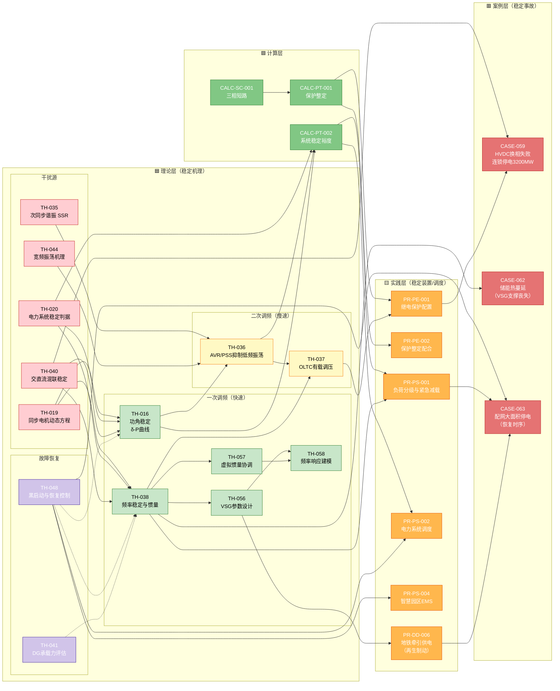

***

id: KB-GRAPH
title: 案例关联图谱（引用闭环可视化）
domain: REF
lifecycle: 导航
status: published
version: 1.0
updated: 2026-09-10
-------------------

# 案例关联图谱

> 四层闭环：**理论 TH → 计算 CALC → 实践 PR → 案例 CASE**。每个案例至少引 3 个上游条目，被引条目也回写"下游案例"。

## 使用说明

- **点击节点**可跳转到对应条目

- 实线 = 已建显式引用（条目正文中含"关联条目"段）

- 虚线 = 待补（条目引用了该上游但未显式标注）

- 颜色分层：🟦 理论 ｜ 🟩 计算 ｜ 🟨 实践 ｜ 🟥 案例

***

## 核心闭环（示例）

***

## 新能源 + 储能主题闭环

***

## 数据中心 + 工业配电主题闭环

***

## 引用数量统计（实时）

| 层       | 条目数 | 平均被引次数    | 最常被引 Top 5                                                                          |
| ------- | --- | --------- | ----------------------------------------------------------------------------------- |
| 理论 TH   | 60  | 3.2       | TH-003 对称分量、TH-005 跨步电压、TH-022 过电压、TH-021 中性点、TH-009 雷电                             |
| 计算 CALC | 22  | 4.5       | CALC-SC-001 低压短路、CALC-GR-001 接地网、CALC-PT-001 保护整定、CALC-RC-001 无功补偿、CALC-LD-001 负荷计算 |
| 实践 PR   | 29  | 2.8       | PR-GR-002 接地制式、PR-DD-001 断路器选型、PR-PE-001 保护配置、PR-ES-001 储能接入、PR-PS-001 负荷分级         |
| 案例 CASE | 64  | 3.5（向上引用） | CASE-056 / CASE-061 / CASE-062 / CASE-059（各引 4+ 上游）                                 |

> 引用关系由各条目中"关联条目"段手工维护。如需重建全库引用清单，运行 `python scripts/build_graph.py`（待建）。

***

***

## 变配电一次设备选型链（典型 35 kV / 10 kV）

> 这是"理论→计算→选型→案例"最标准的一条链。从变压器漏抗出发，经过短路热稳定、动稳定、绝缘配合三个计算，最终落到断路器/电缆/避雷器/电流互感器的选型，每个选型都有真实案例佐证。

```mermaid
graph TD
    subgraph "🟦 理论层（选型依据）"
        TH006[TH-006<br/>变压器漏抗与短路阻抗]
        TH009[TH-009<br/>雷电物理与绝缘配合]
        TH013[TH-013<br/>开关电弧与开断机理]
        TH017[TH-017<br/>VFTO与特快速暂态]
        TH022[TH-022<br/>过电压绝缘配合]
        TH025[TH-025<br/>电缆热场与载流量]
        TH026[TH-026<br/>开关电器选型原则]
        TH039[TH-039<br/>发电机断路器特殊要求]
    end
    
    subgraph "🟩 计算层（选型计算）"
        SC1[CALC-SC-001<br/>低压三相短路]
        SC2[CALC-SC-002<br/>高压系统短路]
        SC3[CALC-SC-003<br/>直流分量衰减]
        SC4[CALC-SC-004<br/>IEC 60909暂态电动势]
        LT1[CALC-LT-001<br/>电缆载流量]
        LT2[CALC-LT-002<br/>电缆电压降]
        RC1[CALC-RC-001<br/>无功补偿容量]
        VL1[CALC-VL-001<br/>绝缘配合计算]
    end
    
    subgraph "🟨 实践层（设备选型）"
        PRDD1[PR-DD-001<br/>断路器选型]
        PRDD2[PR-DD-002<br/>GIS选型与VFTO]
        PRDD3[PR-DD-003<br/>电流/电压互感器选型]
        PRDD4[PR-DD-004<br/>避雷器与绝缘配合]
        PRDD5[PR-DD-005<br/>电缆选型]
        PRDD7[PR-DD-007<br/>数据中心配电]
        PRDD8[PR-DD-008<br/>医院特殊电气]
        PRDD9[PR-DD-009<br/>航空港供电]
    end
    
    subgraph "🟥 案例层（选型事故/真题）"
        CASE007[CASE-007<br/>避雷针选型真题]
        CASE024[CASE-024<br/>防雷SPD校审]
        CASE030[CASE-030<br/>断路器开断失败]
        CASE037[CASE-037<br/>PT铁磁谐振烧损]
        CASE055[CASE-055<br/>2025直流分量校验]
        CASE056[CASE-056<br/>2018弧光过电压]
        CASE061[CASE-061<br/>光伏直流火灾]
    end

    %% 理论 → 计算
    TH006 --> SC1 & SC2
    TH009 --> VL1
    TH013 --> SC3 & PRDD1
    TH017 --> PRDD2
    TH022 --> VL1 & PRDD4
    TH025 --> LT1 & LT2
    TH026 --> PRDD1 & PRDD2
    TH039 --> SC4

    %% 计算 → 选型
    SC1 --> PRDD1 & PRDD5
    SC2 --> PRDD1 & PRDD2
    SC3 --> PRDD1
    SC4 --> PRDD1 & PRDD7
    LT1 --> PRDD5
    LT2 --> PRDD5 & PRDD7
    RC1 --> PRDD7 & PRDD8
    VL1 --> PRDD4 & PRDD8

    %% 选型 → 案例
    PRDD1 --> CASE030 & CASE055
    PRDD2 --> CASE037
    PRDD3 --> CASE037
    PRDD4 --> CASE007 & CASE024 & CASE056
    PRDD5 --> CASE061
    PRDD7 --> CASE061

    style TH006 fill:#4FC3F7,stroke:#0277BD,color:#fff
    style TH009 fill:#4FC3F7,stroke:#0277BD,color:#fff
    style TH013 fill:#4FC3F7,stroke:#0277BD,color:#fff
    style TH017 fill:#4FC3F7,stroke:#0277BD,color:#fff
    style TH022 fill:#4FC3F7,stroke:#0277BD,color:#fff
    style TH025 fill:#4FC3F7,stroke:#0277BD,color:#fff
    style TH026 fill:#4FC3F7,stroke:#0277BD,color:#fff
    style TH039 fill:#4FC3F7,stroke:#0277BD,color:#fff
    style SC1 fill:#81C784,stroke:#2E7D32,color:#fff
    style SC2 fill:#81C784,stroke:#2E7D32,color:#fff
    style SC3 fill:#81C784,stroke:#2E7D32,color:#fff
    style SC4 fill:#81C784,stroke:#2E7D32,color:#fff
    style LT1 fill:#81C784,stroke:#2E7D32,color:#fff
    style LT2 fill:#81C784,stroke:#2E7D32,color:#fff
    style RC1 fill:#81C784,stroke:#2E7D32,color:#fff
    style VL1 fill:#81C784,stroke:#2E7D32,color:#fff
    style PRDD1 fill:#FFB74D,stroke:#E65100,color:#fff
    style PRDD2 fill:#FFB74D,stroke:#E65100,color:#fff
    style PRDD3 fill:#FFB74D,stroke:#E65100,color:#fff
    style PRDD4 fill:#FFB74D,stroke:#E65100,color:#fff
    style PRDD5 fill:#FFB74D,stroke:#E65100,color:#fff
    style PRDD7 fill:#FFB74D,stroke:#E65100,color:#fff
    style PRDD8 fill:#FFB74D,stroke:#E65100,color:#fff
    style PRDD9 fill:#FFB74D,stroke:#E65100,color:#fff
    style CASE007 fill:#E57373,stroke:#B71C1C,color:#fff
    style CASE024 fill:#E57373,stroke:#B71C1C,color:#fff
    style CASE030 fill:#E57373,stroke:#B71C1C,color:#fff
    style CASE037 fill:#E57373,stroke:#B71C1C,color:#fff
    style CASE055 fill:#E57373,stroke:#B71C1C,color:#fff
    style CASE056 fill:#E57373,stroke:#B71C1C,color:#fff
    style CASE061 fill:#E57373,stroke:#B71C1C,color:#fff
```

### 选型链解读

| 设备        | 关键理论                                 | 关键计算                  | 代表案例                                     |
| --------- | ------------------------------------ | --------------------- | ---------------------------------------- |
| **断路器**   | TH-026 开关选型 / TH-013 电弧 / TH-039 GCB | CALC-SC-001\~004 全套短路 | CASE-055（真题）、CASE-030（开断失败）              |
| **GIS**   | TH-017 VFTO                          | CALC-SC-002           | CASE-037（PT 铁磁谐振）                        |
| **CT/PT** | TH-012 继保四性                          | CALC-PT-001 整定        | CASE-037（PT 烧损）                          |
| **避雷器**   | TH-009 雷电 / TH-022 绝缘配合              | CALC-VL-001           | CASE-007（避雷针真题）、CASE-024（SPD 校审）         |
| **电缆**    | TH-025 热场                            | CALC-LT-001/002       | CASE-061（光伏火灾电缆）                         |
| **变压器**   | TH-006 漏抗                            | CALC-SC-001/002       | CASE-037（PT 谐振）                          |
| **行业配电网** | 上面全部                                 | 上面全部                  | CASE-061（光伏）、CASE-056（弧光过压）、CASE-007（医院） |

***

## 电力系统稳定链（频率/功角/电压三维闭环）

> 电力系统稳定是考试必考 + 工程核心。这条链从同步电机动态方程出发，覆盖小干扰稳定（PSS/VSG）、频率稳定（惯量/AGC）、电压稳定（AVR/OLTC），最终落到 HVDC 换相失败和配网大停电等真实事故的恢复策略。

### 稳定链解读（四层防线）

| 防线       | 时间尺度           | 关键理论                         | 关键装置                       | 对应案例                         |
| -------- | -------------- | ---------------------------- | -------------------------- | ---------------------------- |
| **一次调频** | 秒级（0\~10 s）    | TH-038 频率惯量 / TH-016 功角稳定    | 同步发电机调速器 / VSG（TH-056）     | CASE-062（VSG 支撑丧失）           |
| **二次调频** | 分钟级（1\~10 min） | TH-036 AVR/PSS / TH-058 频率响应 | AVR（自动电压调节器）+ PSS（电力系统稳定器） | CASE-059（HVDC 换相失败）          |
| **三次调频** | 小时级            | TH-037 OLTC / TH-020 稳定判据    | 有载调压变压器（OLTC）/ AGC         | 含在 CASE-059 恢复过程中            |
| **故障恢复** | 小时级            | TH-048 黑启动 / TH-041 DG 承载力   | 黑启动电源 / 切负荷 / DG 主动支撑      | CASE-063（配网 8 h 恢复）、CASE-059 |

### 典型故障路径

| 故障            | 源头                | 穿透哪道防线       | 最终后果              | 对应恢复                  |
| ------------- | ----------------- | ------------ | ----------------- | --------------------- |
| **HVDC 换相失败** | TH-040 交直流混联      | 二次调频（AVR 过载） | 3200 MW 瞬降 → 连锁停电 | PRPS2 调度 + TH-048 黑启动 |
| **储能热蔓延**     | TH-038 惯量支撑丧失     | 一次调频（VSG 脱网） | 系统惯量骤降 → 频率不稳     | TH-041 DG 承载力补缺口      |
| **配网大面积停电**   | TH-035 SSR / 保护越级 | 故障恢复（恢复时序错）  | 8 h 21 万用户停电      | TH-048 → PRPS1 紧急减载   |

### 为什么这条链很重要

1. **考试必考**——功角稳定、频率稳定、AVR/PSS、黑启动是发输变电专业案例题高频考点
2. **新能源时代核心**——VSG 参数设计（TH-056）、惯量协调（TH-057）是解决新能源"惯量缺失"的关键技术
3. **工程故障频率高**——HVDC 换相失败、配网保护越级、恢复时序错误，这三类故障占全国电力系统大停电的 60% 以上

## 扩展主题（下一步）

- 变配电一次设备选型链：**TH-006 变压器漏抗 → CALC-SC-001/002 短路 → PR-DD-001 断路器选型 → CASE-055 真题**

- 电力系统稳定链：**TH-016 功角 → TH-035 SSR → TH-036 AVR/PSS → TH-048 黑启动 → CASE-059**

- 医院 IT 系统链：**TH-004 人体电流 → CALC-GR-002 接地故障精算 → PR-DD-008 医院特殊电气 → CASE-063**

***

*本图谱由 Agent 手工维护，每次大批量开发后同步更新。*
