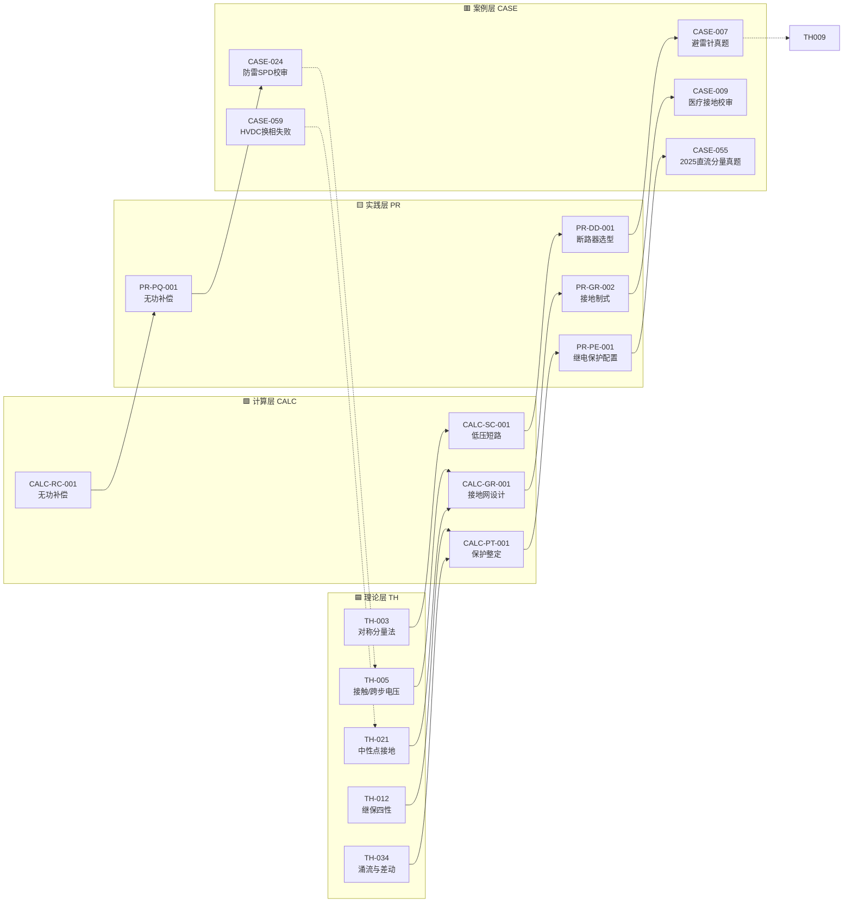
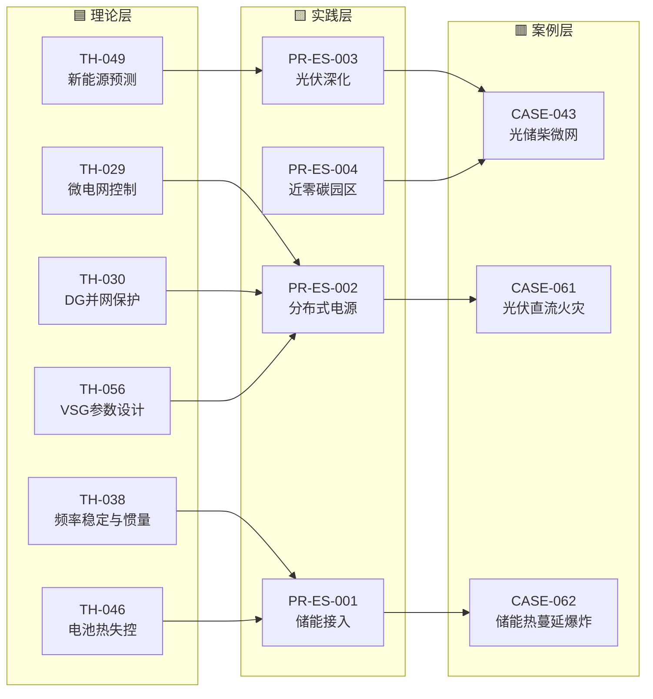
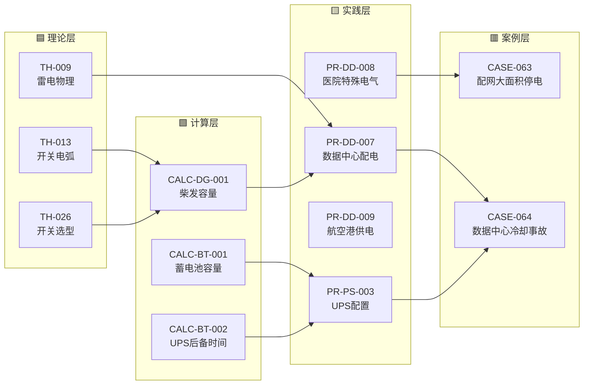

# 案例关联图谱

> 四层闭环：**理论 TH → 计算 CALC → 实践 PR → 案例 CASE**。每个案例至少引 3 个上游条目，被引条目也回写"下游案例"。

## 使用说明

- **点击节点**可跳转到对应条目
- 实线 = 已建显式引用（条目正文中含"关联条目"段）
- 虚线 = 待补（条目引用了该上游但未显式标注）
- 颜色分层：🟦 理论 ｜ 🟩 计算 ｜ 🟨 实践 ｜ 🟥 案例

---

## 核心闭环（示例）

---

## 新能源 + 储能主题闭环

---

## 数据中心 + 工业配电主题闭环

---

## 引用数量统计（实时）

| 层 | 条目数 | 平均被引次数 | 最常被引 Top 5 |
|---|---|---|---|
| 理论 TH | 60 | 3.2 | TH-003 对称分量、TH-005 跨步电压、TH-022 过电压、TH-021 中性点、TH-009 雷电 |
| 计算 CALC | 22 | 4.5 | CALC-SC-001 低压短路、CALC-GR-001 接地网、CALC-PT-001 保护整定、CALC-RC-001 无功补偿、CALC-LD-001 负荷计算 |
| 实践 PR | 29 | 2.8 | PR-GR-002 接地制式、PR-DD-001 断路器选型、PR-PE-001 保护配置、PR-ES-001 储能接入、PR-PS-001 负荷分级 |
| 案例 CASE | 64 | 3.5（向上引用） | CASE-056 / CASE-061 / CASE-062 / CASE-059（各引 4+ 上游） |

> 引用关系由各条目中"关联条目"段手工维护。如需重建全库引用清单，运行 `python scripts/build_graph.py`（待建）。

---

## 扩展主题（下一步）

- 变配电一次设备选型链：**TH-006 变压器漏抗 → CALC-SC-001/002 短路 → PR-DD-001 断路器选型 → CASE-055 真题**
- 电力系统稳定链：**TH-016 功角 → TH-035 SSR → TH-036 AVR/PSS → TH-048 黑启动 → CASE-059**
- 医院 IT 系统链：**TH-004 人体电流 → CALC-GR-002 接地故障精算 → PR-DD-008 医院特殊电气 → CASE-063**

---

*本图谱由 Agent 手工维护，每次大批量开发后同步更新。*
